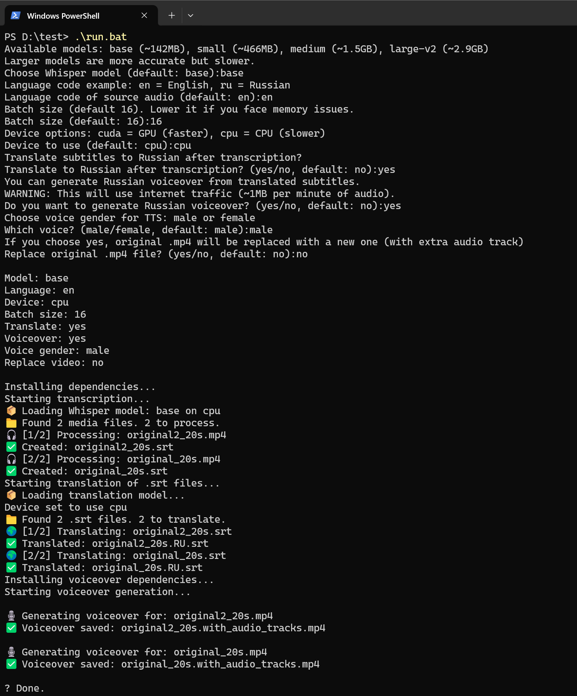

# 🎧 WhisperSubtitleGen

## 🚀 Русская озвучка и субтитры полностью офлайн / Russian Voiceover & Subtitles Offline
## ⚠️ Требуется Python 3.10 / Python 3.10 Required (only this version)

> **Автоматическая генерация субтитров и озвучки для офлайн-видео**  
> **Automatic subtitle generation and Russian voiceover for offline videos**

---

## 📌 О проекте / About the Project

Этот проект предназначен для генерации `.srt` субтитров из видеофайлов и добавления **русской озвучки** на основе переведённого текста.  
This tool generates `.srt` subtitles from video/audio and creates **Russian voiceover** using translated text.

Работает полностью офлайн и использует:  
It works fully offline and uses:

- [Faster-Whisper](https://github.com/guillaumekln/faster-whisper) — распознавание речи / speech-to-text  
- `ffmpeg` — обработка медиа / media processing  
- `edge-tts` — синтез речи / speech synthesis

---

## 🖼️ Пример результата / Example Output



В папке `examples/` находятся:  
In the `examples/` folder:

- `original.mp4` — оригинальное видео / original video  
- `original.srt` — субтитры на английском / English subtitles  
- `original.RU.srt` — переведённые субтитры / translated subtitles  
- `translated.mp4` — видео с русской озвучкой / video with Russian voiceover

---

## 🆕 Новые возможности / New Features

✅ **Восстановление прогресса** — уже обработанные файлы пропускаются при повторном запуске.  
✅ **Progress tracking** — already processed files are skipped on rerun.

Все скрипты используют `progress_tracker.py`, который сохраняет файл `.progress.log`.  
All scripts use `progress_tracker.py` to save a `.progress.log` file.

---

## 📁 Структура проекта / Project Structure

```
WhisperSubtitleGen/
├── run.bat                :: Запуск в Windows / Windows launcher
├── run.sh                 :: Запуск в Linux / Linux launcher
├── transcribe_all.py      :: Генерация субтитров / Subtitle generation
├── translate_srt.py       :: Перевод субтитров / Subtitle translation
├── voiceover_srt.py       :: Озвучка текста / TTS voiceover
├── progress_tracker.py    :: Трекинг прогресса / Progress tracking
├── requirements.txt       :: Зависимости / Dependencies
├── images/screenshot.png  :: Скриншот / Screenshot
├── examples/              :: Примеры результата / Output examples
```

---

## 💻 Как запустить / How to Run

### ✅ Windows

1. Убедитесь, что установлен **Python 3.10**  
   Make sure **Python 3.10** is installed

2. Дважды кликните `run.bat`  
   Double-click `run.bat`

3. Следуйте инструкциям: модель, язык, озвучка  
   Follow the prompts: model, language, voiceover

4. Скрипт создаст окружение, установит зависимости и обработает видео  
   Script will create environment, install dependencies, and process videos

### 🐧 Linux

1. Установите Python 3.10 и `ffmpeg`  
   Install Python 3.10 and `ffmpeg`

2. Сделайте `run.sh` исполняемым:  
   Make `run.sh` executable:
   ```bash
   chmod +x run.sh
   ./run.sh
   ```

---

## ⚙️ Поддерживаемые форматы / Supported Formats

- 🎞️ Видео / Video: `.mp4`, `.mkv`, `.avi`  
- 🎵 Аудио / Audio: `.mp3`, `.wav`  
- 📄 Субтитры / Subtitles: `.srt` saved next to video

---

## 🔈 Озвучка / Voiceover

- Используется `edge-tts` — синтез на русском языке  
  Uses `edge-tts` for Russian speech synthesis
- Выбор мужского или женского голоса  
  Choose male or female voice
- Озвучка добавляется как **вторая аудиодорожка**  
  Voiceover added as **second audio track** in `.mp4`

---

## 🧪 Проверка результата / Checking the Result

- Субтитры (`.srt`) находятся рядом с видео  
  Subtitles are saved next to video
- Озвученное видео — `translated.mp4`  
  Video with voiceover — `translated.mp4`
- Открой в VLC — выбери аудиодорожку или субтитры  
  Open in VLC — select audio track or subtitles

---

## 📜 Лицензия / License

MIT License